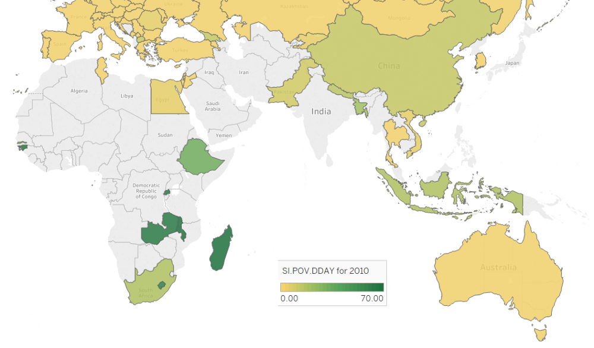

# Poverty Prediction using Machine Learning Methods 
Time-series forecasting of World Development Indicator (WDI) for poverty using machine learning methods.

In 2014 the UN called for a data revolution to put the best available tools and methods to work in service of achieving the Sustainable Development Goals (SDGs). Here, I attempt to use machine learning to forecast one of the indicators for SDG 1, it's objective being to "end poverty in all it's forms everywhere".

Blog posts with details and walkthrough of the code can be found [here](https://medium.com/@fergus.oboyle/can-machine-learning-be-used-to-forecast-poverty-c7a54bbd6e6c) and [here](https://medium.com/@fergus.oboyle/classical-time-series-vs-machine-learning-methods-80290850bd5b).

Tableau dashboard exploring the correlations between the WDI variables and the target can be found [here](https://public.tableau.com/views/WorldDevelopmentIndicators_15628521058330/Dashboard1?:embed=y&:display_count=yes&publish=yes&:origin=viz_share_link). It's best viewed in full screen mode.

In this project, I will forecast the WDI "Poverty headcount ratio at $1.90 a day (2011 PPP) (% of population)". This is one of the principal indicators used to measure progress towards meeting the first Sustainable Development Goal. I will forecast the indicator for the year 2010 and use data up to and including the year 2009 from all indicators (including the target indicator) using machine learning techniques. By choosing a target year (i.e. 2010) for which there is data, allows measurement of the predictions against the actual reported values and, therefore, the measurement of the success (or failure) of our algorithms. Unfortunately, due to a lot of missing data in the WDI dataset, there is only a recorded measurement for the target WDI in 2010 for a subset of countries. This will be discussed more in the blog. The degree of  missing data can be seen in the following map:

## Results

The predicted value for our target poverty metric is compared with the recorded value for all countries that have a recorded value, for the target year.

The following table shows results comparing root mean square error for different methods.

| Method | RMSE score |
| ------ | -----------|
| Naive  | 4.77 |
| Holt's exponential smoothing | 4.79 |
| OLS linear regression | 7.40 |
| Ridge regression | 7.07 |
| Lasso regression | 4.05 |
| Random forest | 5.36 |
| XGBoost | 5.14 |
| XGBoost (No imputation) | 3.11 |

XGBoost without any attempt to impute data prior to training turned out to be by far the most successful model I tried. I did some hand-tuning on parameters for XGBoost to obtain the RMSE score of 3.11.

Interestingly, a key parameter for success with XGBoost was tuning of reg_lambda. This is the L2 regularisation term, similar to what is used in ridge linear regression. Therefore, our two best performing models, XGBoost and lasso both perform regularisation.

It is perhaps not a surprise that lasso regression performed so well and better than ridge regression. According to *An Introduction to Statistical Learning*:

> In general, one might expect the lasso to perform better in a setting where a relatively small number of predictors have substantial 
> coefficients, and the remaining predictors have coefficients that are very small or that equal zero. Ridge regression will perform 
> better when the response is a function of many predictors, all with coefficients of roughly equal size.

It is quite likely in our case that the majority of the predictors are unrelated to the target variable and this might explain why 
lasso is so effective. The following plot shows the results from the tuning of the alpha parameter during the cross-validation 
training process of the lasso model:

  

The green line marks the point at which the lowest RMSE was recorded. This point corresponds to an alpha value of 0.43.
One surprising thing to note regarding the cross-validation training of the lasso was that the model produced using standard k-folds cross-validation generalized better than the model from the time-series cross-validation method.

The two most significant findings from the investigation were:

* XGBoost and other methods that employed regularisation to reduce model variance performed best.
* XGBoost's sparsity aware spilt finding algorithm handled missing values in a way that outperformed imputation methods.

## Packages

The code can be run from a set of Jupyter notebooks (in the notebooks directory) with support from some python ultily files (in the utils directory). Installing Anaconda and running jupyter from it is the easiest way to go (see below).

The required packages are specified in the environment.yml file. The environment and all required packages can be reconstructed in an anaconda environment by following the instructions in the Execution section. 

## Files

* README.md: This file    
* notebooks/clean_input_streams.ipynb: Data Preparation before modelling   
* notebooks/linear_regression_predictor.ipynb: Linear Models 
* notebooks/exponential_smoothing.ipynb: Classical Holt's Method
* notebooks/tree_based_predictor.ipynb: Random forest method and gradient smoothing
* notebooks/xgboost_predictor.ipynb: XGBoost predictor
* notebooks/naive_predictor.ipynb: Naive Prediction Model  
* notebooks/data_gathering/data_collection.ipynb: World Bank API interface   
* notebooks/data_gathering/world_bank_bulk_csv.ipynb: Reading from World Bank csv file 
* utils/evaluate.py : utilities for evaluating models  
* utils/missing.py: utilities related to missing values  
* utils/preprocess.py: utiltiies for preprocessing of data before modelling   
* environment.yml: List of required packages for setting up of Anaconda environment  
* LICENSE: License file   

## Installation and execution

### Checkout code from Github

1. Follow [these](https://help.github.com/en/articles/cloning-a-repository) instructions for cloning this repo to a location on your computer.

### Installing Anaconda

1. Download Anaconda from [here](https://www.anaconda.com/distribution/).
2. Install Anaconda using [these](https://docs.anaconda.com/anaconda/install/) instructions.
3. Open the Anaconda shell.
3. Within the Anaconda shell, change directory to the root directory of the local sustainable-dev-goals-forecasting repo.
4. Create a new environment in the Anaconda Shell: >conda env create -n my_new_env --file environment.yml.
5. Switch to the new environment: >conda activate my_new_env.

### Running Jupyter Notebook

1. In the Anaconda shell, if you are not already in the root directory of the local sustainable-dev-goals-forecasting repo, change directory to there now.
2. Launch Jupyter Notebook from the Anaconda shell (>jupyter notebook). The Jupyter Notebook app will open up in a web browser. 

### Reading data,preprocessing, and execution of the predictive models

1. Follow the instructions in the next section to download the World Development Indicator data.
2. Run world_bank_bulk_csv.ipynb to read data from the WDIData.csv. world_bank_bulk_data.pkl is created in data/.
3. Run clean_input_streams.ipynb to clean data. cleaned_data.pkl is created.
4. Run model files: naive_predictor.ipynb or linear_regression_predictor.ipynb.

## Access to data from the World Bank

1. Data can be accessed at the World Bank [Data Catalog](https://datacatalog.worldbank.org/dataset/world-development-indicators).
2. Click on the "Data & Resources" tab.
3. Download data in CSV format.
4. Extract files from the donloaded folder.
5. Place WDIData.csv into a data/ subfolder of your local repo.

## Possible next steps

* Try other libraries that include tree-based models that cope with sparse input data (H20?) 
* Try more advanced methods of imputation using mtsdi package in R  
* Try feature reduction using the foreward selection algorithm    
* Try  more classical time-series forecasting algorithms. For example, the dynamic method described in chapter 9 of *Forecasting: Principles and Practice*  

